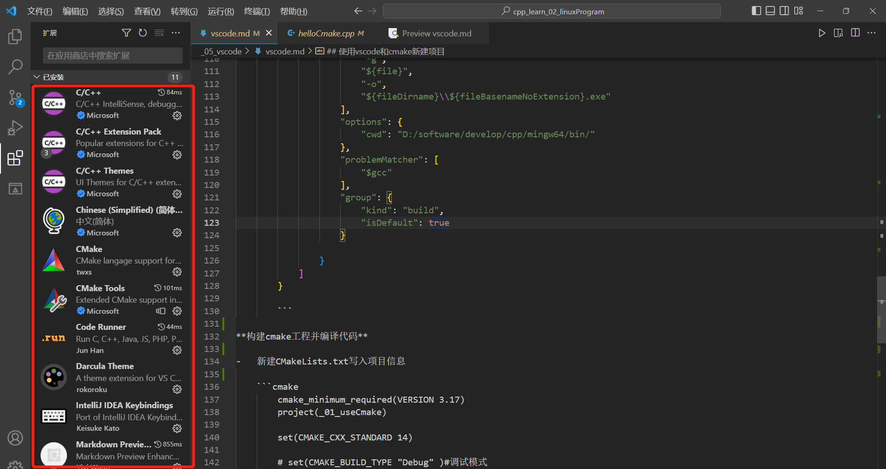
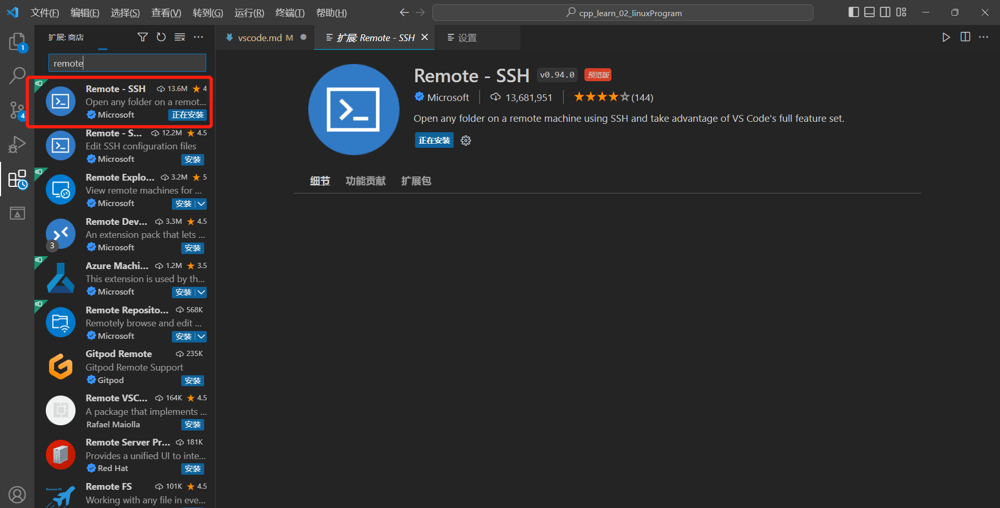
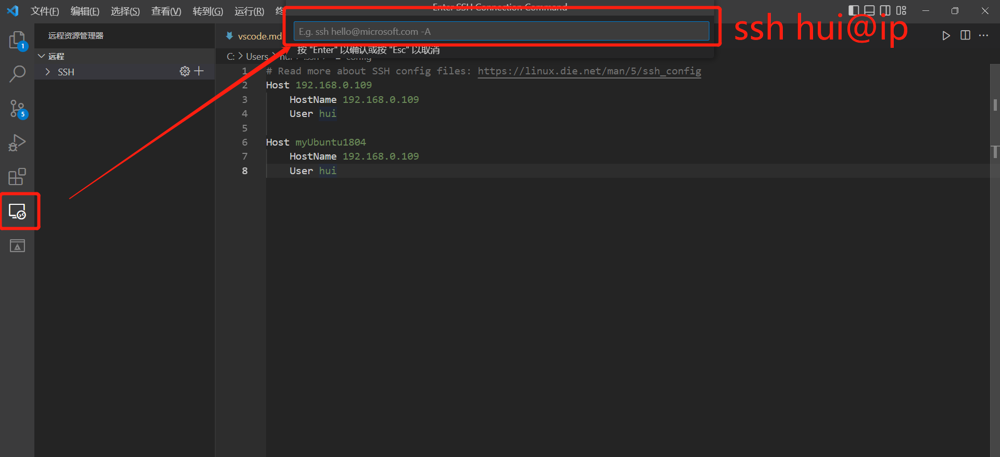
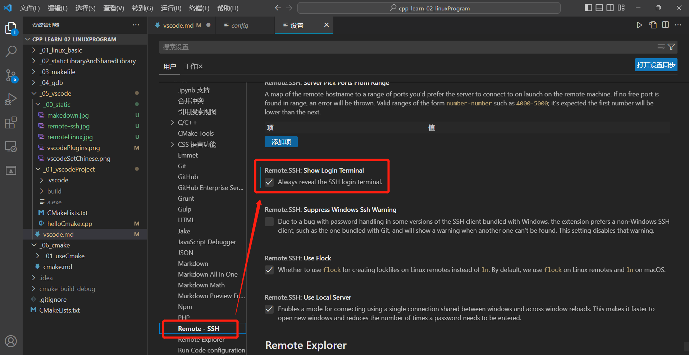
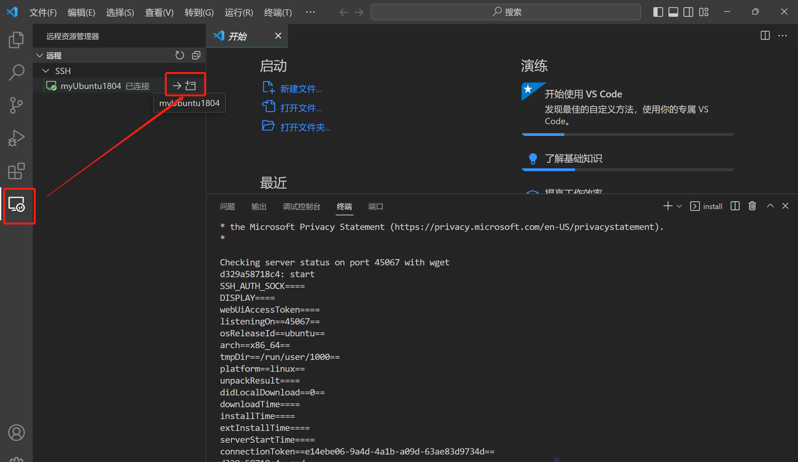

[toc]  
    [Linux下C/Cpp开发环境搭建](#Linux下C/Cpp开发环境搭建)  

## Window下搭建vscode和c/c++开发环境
**安装vscode**

-   [vscode官网下载地址](https://code.visualstudio.com/Download)    

-   配置中文
    
    
**安装mingw**

-   下载mingw  
    [mingw下载地址](https://sourceforge.net/projects/mingw-w64/files/)
    > 注意: 下拉选择x86_64-win32-seh, 下载的是一个压缩文件, 解压并将bin目录配置到环境变量'

-   检查mingw是否安装成功
    ```shell
        # 命令行输入查看minGW(配置好环境变量必须新开一个)
        gcc -v
        g++ -v
        gdb -v
    ```
**cmake安装**
-   [下载cmake(下载msi, 不用自己配环境变量)](https://cmake.org/download/#previous)

**vscode配置开发环境**
-   插件安装  
    


## 使用vscode和cmake新建项目
**在vscode中配置c++项目**  

-   将下面三个json文件的内容复制到项目的.vscode目录下的对应文件中

    -   c_cpp_properties.json 文件(不存在则新建)
        ```json5
            {
                "configurations": [
                {
                "name": "Win64",
                "includePath": [
                "${workspaceFolder}/**"
                ],
                "defines": [
                "_DEBUG",
                "UNICODE",
                "_UNICODE"
                ],
                // 此处是编译器路径，以后可直接在此修改
                "compilerPath": "D:/software/develop/cpp/mingw64/bin/g++.exe",
                "cStandard": "c11",
                "cppStandard": "c++17",
                "intelliSenseMode": "gcc-x64"
                }
                ],
                "version": 4
                }
        ```
       
    -   launch.json 文件(不存在则新建)
        ```json5
        {
            // 使用 IntelliSense 了解相关属性。
            // 悬停以查看现有属性的描述。
            // 欲了解更多信息，请访问: https://go.microsoft.com/fwlink/?linkid=830387
            "version": "0.2.0",
            "configurations": [
        
                {
                    "name": "(gdb) Launch",
                    "preLaunchTask": "g++.exe build active file",   //调试前执行的任务，就是之前配置的tasks.json中的label字段
                    "type": "cppdbg",                           //配置类型，只能为cppdbg
                    "request": "launch",                        //请求配置类型，可以为launch（启动）或attach（附加）
                    "program": "${fileDirname}\\${fileBasenameNoExtension}.exe",//调试程序的路径名称
                    "args": [],                                 //调试传递参数
                    "stopAtEntry": false,
                    "cwd": "${workspaceFolder}",
                    "environment": [],
                    "externalConsole": true,//true显示外置的控制台窗口，false显示内置终端
                    "MIMode": "gdb",
                    "miDebuggerPath": "D:/software/develop/cpp/mingw64/bin/gdb.exe",
                    "setupCommands": [
                        {
                            "description": "Enable pretty-printing for gdb",
                            "text": "-enable-pretty-printing",
                            "ignoreFailures": true
                        }
                    ]
                }
            ]
        }
        ```
        
    -   tasks.json 文件(不存在则新建)
        ```json5
        {
            // See https://go.microsoft.com/fwlink/?LinkId=733558 
            // for the documentation about the tasks.json format
            "version": "2.0.0",
            "tasks": [
                {
                    "type": "shell",
                    "label": "g++.exe build active file", //这里注意一下，见下文
                    "command": "D:/software/develop/cpp/mingw64/bin/g++.exe",
                    "args": [
                        "-g",
                        "${file}",
                        "-o",
                        "${fileDirname}\\${fileBasenameNoExtension}.exe"
                    ],
                    "options": {
                        "cwd": "D:/software/develop/cpp/mingw64/bin/"
                    },
                    "problemMatcher": [
                        "$gcc"
                    ],
                    "group": {
                        "kind": "build",
                        "isDefault": true
                    }
        
                }
            ]
        }
        
        ```

**构建cmake工程并编译代码**

-   新建CMakeLists.txt写入项目信息

    ```cmake
        cmake_minimum_required(VERSION 3.17)
        project(_01_useCmake)
        
        set(CMAKE_CXX_STANDARD 14)
    
        # set(CMAKE_BUILD_TYPE "Debug" )#调试模式
        
        add_executable(test01 helloCmake.cpp)#测试代码
    ```

-   创建cmake编译目录并构建cmake工程

    ```shell
        # 在vscode项目路径下执行
        mkdir build
        cd build
        # 指定编译器并构建cmake工程, 生成makefile文件
        cmake -G "MinGW Makefiles" ..   # 首次创建需要指定编译器, 之后只需使用命令 cmake .. 
        # 编译程序
        make 
    ```
## Vscode远程开发环境搭建

**vscode配置远程linux**
-   vscode安装远程插件
    

-   添加远程主机
    在安装远程插件后, vscode左侧会出现远程的按钮, 点击进行如下操作
    

-   vscode设置显示远程终端
    在连接linux之前需要能够打开远程终端
    

-   连接linux
    
** 

## Linux下C/Cpp开发环境搭建
```shell
    # 更新apt
    sudo apt update
    
    # 一键安装gcc, g++, gdb
    sudo apt install build-essential gdb
    
    # 安装cmake
    sudo apt install cmake
    
    # 查看软件是否安装成功
    gcc -v
    g++ -v
    gdb -v
    cmake -version

```


